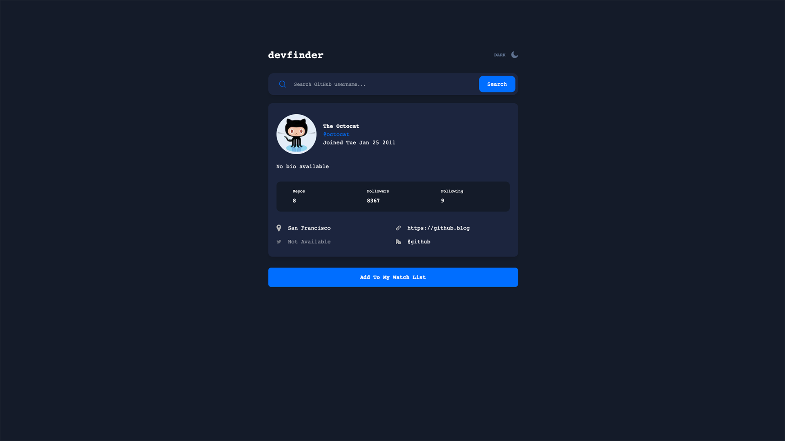

# Frontend Mentor - GitHub user search app solution

This is a solution to the [GitHub user search app challenge on Frontend Mentor](https://www.frontendmentor.io/challenges/github-user-search-app-Q09YOgaH6). Frontend Mentor challenges help you improve your coding skills by building realistic projects. 

## Table of contents

- [Overview](#overview)
  - [The challenge](#the-challenge)
  - [Screenshot](#screenshot)
  - [Links](#links)
- [My process](#my-process)
  - [Built with](#built-with)
  - [What I learned](#what-i-learned)
  - [Continued development](#continued-development)
  - [Useful resources](#useful-resources)
- [Author](#author)
- [Acknowledgments](#acknowledgments)

**Note: Delete this note and update the table of contents based on what sections you keep.**

## Overview

### The challenge

Users should be able to:

- View the optimal layout for the app depending on their device's screen size
- See hover states for all interactive elements on the page
- Search for GitHub users by their username
- See relevant user information based on their search
- Switch between light and dark themes
- **Bonus**: Have the correct color scheme chosen for them based on their computer preferences. _Hint_: Research `prefers-color-scheme` in CSS.

### Screenshot

### Links

- Solution URL: [GitHubRepo](https://github.com/barnettet31/github-user-search-crud)
- Live Site URL: [Live Site](https://github-user-search-crud-neiidhfuw-barnettet31.vercel.app/)

## My process

### Built with

- Semantic HTML5 markup
- CSS custom properties
- Flexboxs
- CSS Grid
- Mobile-first workflow
- [React](https://reactjs.org/) - JS library
- [Next.js](https://nextjs.org/) - React framework
- [TailwindCSS](https://www.tailwindcss.com) - For styles
- [HeadlessUI](https://headlessui.dev/) - For components
- [Vercel](https://vercel.com/) - For deployment
- [GitHub API](https://docs.github.com/en/rest) - For data

- Website - [TravCodez](https://www.travcodez.com/blog/github_user_project)
- Frontend Mentor - [@barnettet31](https://www.frontendmentor.io/profile/barnettet31)
- LinkedIn - [barnettetravis31](https://www.linkedin.com/in/barnettetravis31/)